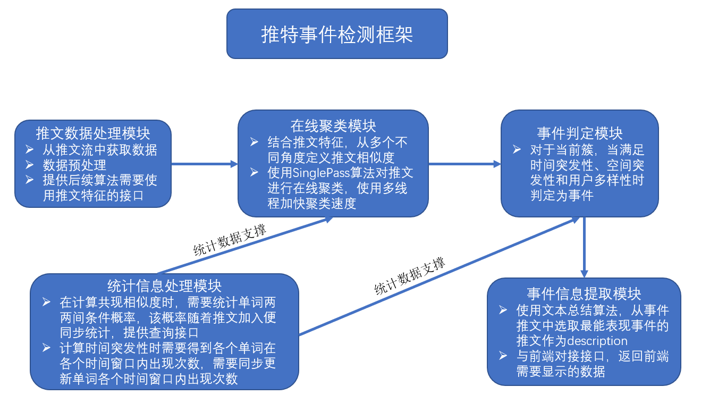
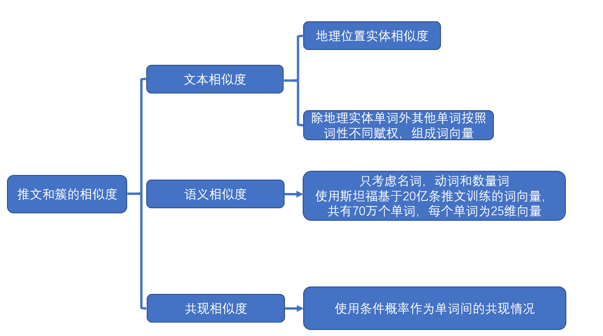

# 事件检测
​        分为推文数据提取、在线聚类、事件判定和事件信息提取四个模块，事件提取出来的信息需要与前端对接。除此之外，还需要维护一些全局变量，例如两两单词间条件概率，每个单词的word2vec向量，每个单词在不同时间段出现次数，进而可以看出这些单词在哪些时间段具有突发性。

## 一、推文数据提取模块
- `text`：推文文本
- `words`：推文文本进行分词、词性检测和单词是否是[人名、地名、机构名]
- `event`：根据模型判断该条推文是否是事件推文，只处理event=true的推文
- `coordinates`：推文所属经纬度坐标
- `lang`：推文语言，只处理英文推文，即需要满足lang=en
- `created_at_ts`：推文发送的时间戳(单位:s)
- `user`：发送者名称(screen_name)

## 二、在线聚类模块
- 使用SinglePass在线聚类方法进行聚类，主要是考虑到实时性
- 使用聚类方法就需要定义推文间相似度，短文本相似度不好处理，需要从不同的角度定义相似度

- 簇模块需要有以下字段：
  - `textList`：推文文本组成的列表
  - `timeList`：推文时间组成的列表
  - `userList`：推文发送者组成的列表
  - `locDict`：地理实体单词及其出现次数组成的字典
  - `ner`：三种实体组成的字典
  - `wordsWeight`：每个单词及其权重
  - `semanticVector`：由每个单词的word2vec向量得到簇的语义向量
- 斯坦福的推文词向量网址为[斯坦福推文词向量下载](http://nlp.stanford.edu/data/glove.twitter.27B.zip)

#### 在线聚类模块加速策略：

- 当计算每条推文与已有的各个簇相似度时，使用多个线程，线程数根据CPU核数来决定，一般四核八线程电脑使用4-8个线程即可(因为此运算是CPU密集型任务，线程数=核数效率最高)，每个线程计算该推文与部分已有簇的相似度。注意：这里会涉及到多个线程修改共享变量，需要在临界区加锁。
  - 4-8线程时速度是单线程时的2.3倍左右
  - 30线程时仅为单线程时的2倍，意味着频繁的切换线程也是要消耗时间的
  - 如果是服务器上，有多个CPU多个核，则可以提高线程数
- 簇内数据是若干条推文的组合，例如簇的单词向量就是该簇内推文单词的组合，如果簇过大，会使得簇内增加很多噪声数据，也会影响计算效率。因此，在每次推文更新完簇信息后，对簇进行一次数据清洗，清除掉噪声数据和冗余数据。

## 三、事件判定模块
- 事件定义：特定时间和空间内发生的事，还需要有大量人参与讨论
- 时间突发性：根据簇内推文的单词在该时间段是否具有突发性来判断(z-分数判断是否具有突发性)
- 空间突发性：根据簇内地理实体及其出现次数，利用信息熵来判断事件是否具有空间突发性
- 用户多样性：根据推文发送者数量情况判断，如果一个簇内推文是由少数几个人发布的，很可能是水军或者广告
- 经过上述三个过滤器后簇被认作是事件

## 四、事件信息提取模块

经过事件判定的簇

- `description`：选择一条具有代表性的推文
- `location`：地理位置，ex: [{latitude: 48, longitude: -2.92, location: "brittany"}]
- `time`：事件时间
- `ner`：实体，ex：{org: [], per: [["a", 2], ["b", 1]], loc: []}
- `picture_path`：返回`description`对应推文的图片，如果没有则为None

## 五、统计信息模块

每输入一条推文，需要统计以下信息：

- 设计一个双端队列，双端队列里面始终维持队头与队尾推文时间间隔不超过24h，统计这个窗口内单词的共现次数，这是一个滑动窗口动态统计的过程

- 每个单词在每个窗口内出现次数
- 加载单词词向量

该模块内统计功能可以重新开一个线程来统计，与主线程分开，加快效率。